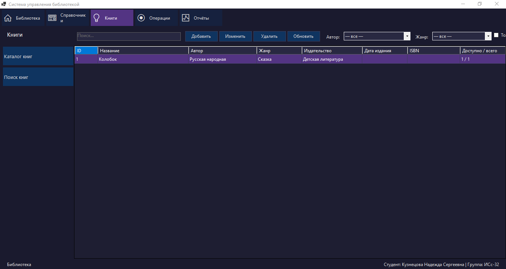
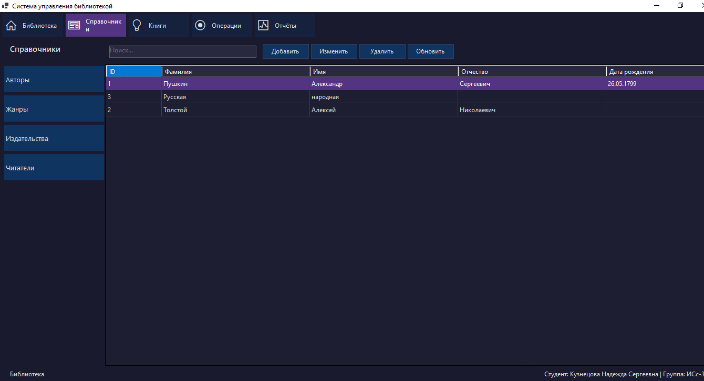
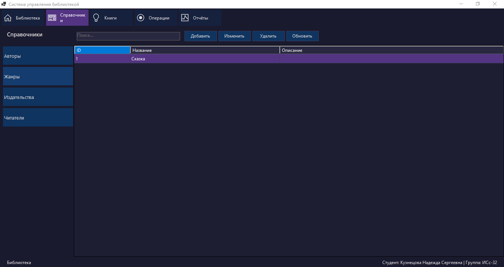
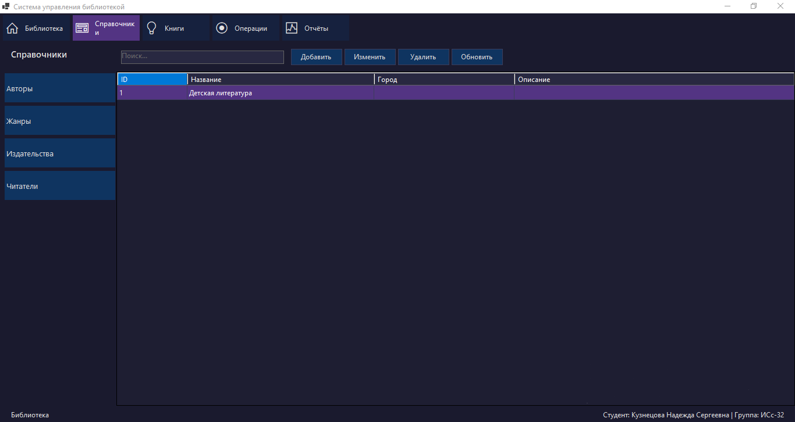
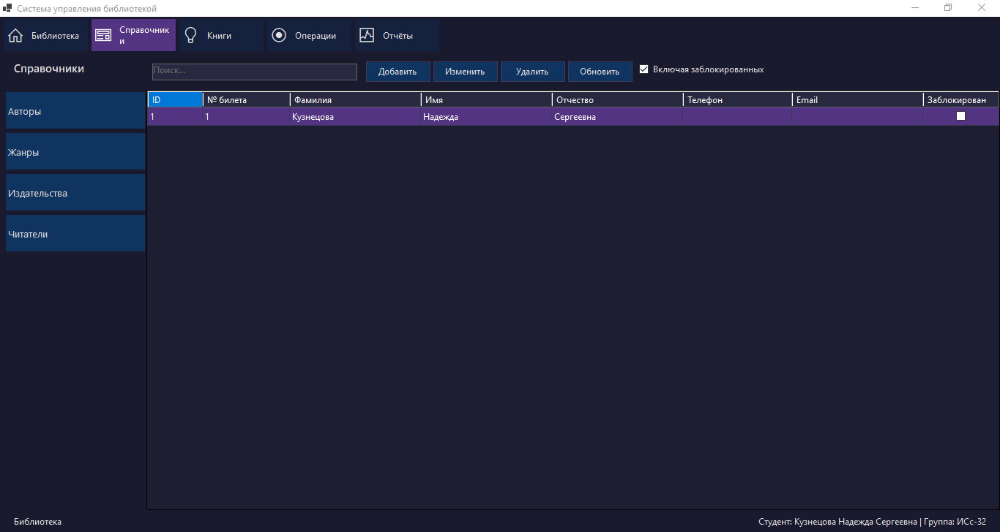
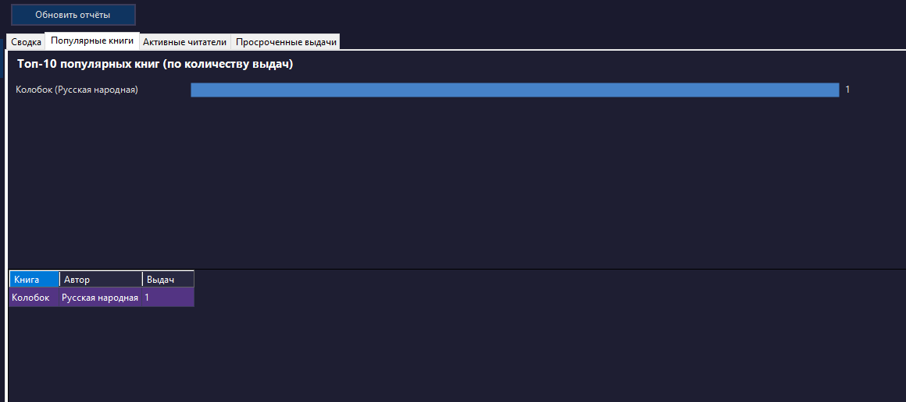

# LibraryManagement

Система управления библиотекой - десктопное приложение на C# / .NET 10 / WinForms с многослойной архитектурой и Entity Framework Core (SQLite).

## О проекте

LibraryManagement - производственно-практический проект автоматизации работы библиотеки: учёт книг, читателей, авторов, жанров, издательств, выдача и возврат книг, формирование отчётов.

### Ключевые возможности

- Управление каталогом книг (добавление, редактирование, удаление, поиск)
- Учёт читателей и контактных данных
- Учёт авторов, жанров и издательств
- Выдача и возврат книг с отслеживанием статуса
- Отчёты и аналитика (графики выдач, статистика)
- Валидация входных данных через FluentValidation
- Локальное хранилище SQLite - не требует отдельного сервера БД
- Тёмная индиго-тема интерфейса

## Архитектура

Решение построено по принципам Clean Architecture - зависимости направлены к Domain:

```
src/
- LibraryManagement.Domain        (сущности, перечисления, доменные правила)
- LibraryManagement.Application   (сценарии использования, валидаторы, интерфейсы сервисов)
- LibraryManagement.Data          (EF Core: DbContext, миграции, конфигурации сущностей)
- LibraryManagement.WinForms      (UI: формы, контролы, DI-композиция)
```

| Слой | Назначение |
|---|---|
| Domain | Author, Book, Genre, Loan, Publisher, Reader, User; LoanStatus, UserRole |
| Application | Валидаторы FluentValidation, контракты сервисов, бизнес-сценарии |
| Data | LibraryDbContext, миграции EF Core, конфигурации маппинга сущностей |
| WinForms | MainForm + контролы по сущностям: Books, Readers, Authors, Genres, Publishers, Loans, Reports |

## Стек

- Язык: C# 13
- Платформа: .NET 10
- UI: Windows Forms
- ORM: Entity Framework Core 10.0.7
- БД: SQLite
- Валидация: FluentValidation 12.1.1
- DI / Configuration: Microsoft.Extensions.Hosting + Microsoft.Extensions.Configuration.Json

## Быстрый старт

### Требования

- Windows 10/11
- .NET 10 SDK

### Сборка и запуск из CLI

```powershell
git clone https://github.com/NadKuznetsova/Practice.git
cd Practice

dotnet restore
dotnet build
dotnet run --project src/LibraryManagement.WinForms
```

При первом запуске база данных library.db создаётся автоматически. Приложение запускается под учётной записью администратора.

### Строка подключения

Файл src/LibraryManagement.WinForms/appsettings.json:

```json
{
  "ConnectionStrings": {
    "Library": "Data Source=library.db"
  }
}
```

## Скриншоты

### Главное меню


### Каталог книг



### Авторы



### Жанры



### Издательства



### Читатели



### Топ популярных книг



## Лицензия

MIT
